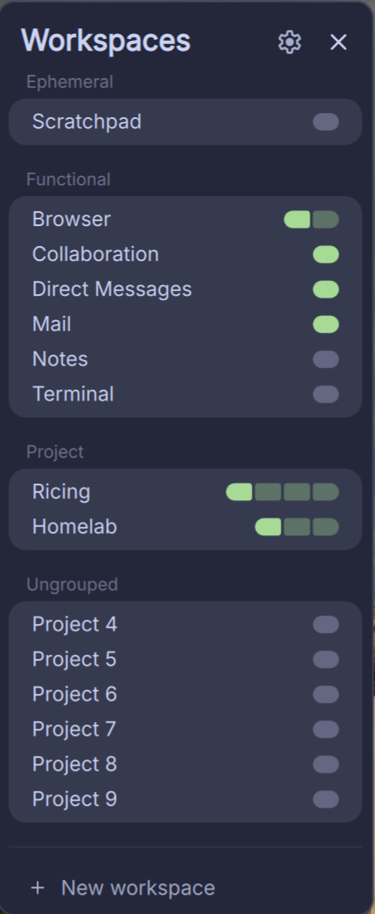
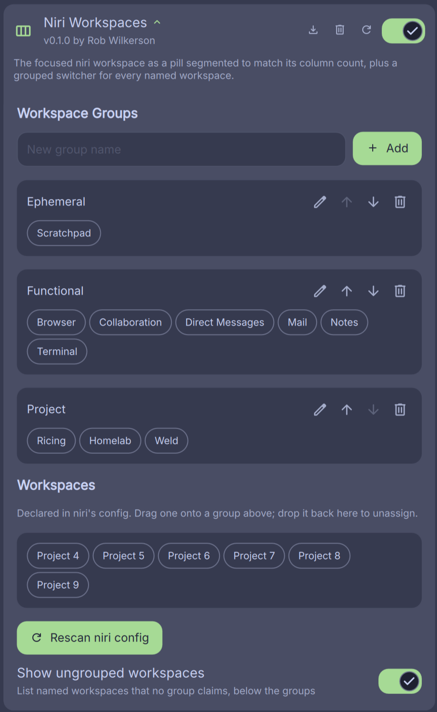

# Niri Workspaces

A [DankMaterialShell](https://github.com/AvengeMedia/DankMaterialShell) dankbar
widget that shows the **focused** niri workspace as a pill **segmented to match
its column count**, and opens a grouped switcher for every named workspace.

Where the built-in workspace switcher renders every workspace on the bar, this
declutters to just the focused one — its name, and a small pill whose segment
count equals the number of niri columns currently in that workspace. The full
list moves into a dropdown you organize yourself.

## What It Does

**On the bar:** the focused workspace's name, followed by a pill with one
segment per column. The segment holding the active window is drawn at full
strength; the rest are faded.


**In the dropdown:** every named workspace, arranged into groups you define,
each row carrying the same column pill. Click a row to switch to it. A "New
workspace" action at the bottom jumps to niri's trailing auto-empty workspace.

The focused workspace sits in its own group, marked with a dot and a bolder
name. Listing it costs a row that does nothing when clicked, but it keeps every
group at full height so the list holds its shape as you move around.



## niri Only

Columns come from `layout.pos_in_scrolling_layout`, a niri scrollable-tiling
concept, read from DMS's `NiriService`. It does nothing useful on other
compositors.

## Requirements

- DankMaterialShell ≥ 1.4.0
- niri

## Install

```sh
mkdir -p ~/.config/DankMaterialShell/plugins
git clone <repo-url> ~/.config/DankMaterialShell/plugins/niriWorkspaces
```

Then in DMS: Settings → Plugins → Scan, enable **Niri Workspaces**, and add it
to a bar section. You'll likely want to remove the built-in workspace switcher
to avoid duplication.

## Grouping Workspaces

niri has no concept of workspace groups — its config is a flat list of
`workspace "Name" {}` declarations — so grouping lives entirely in this plugin's
settings.

Open Settings → Plugin Management → Niri Workspaces, or click the gear in the
dropdown header. There you can:

- **Define groups** by name, in the order they should render
- **Rename a group** with the pencil on its card
- **Assign workspaces** by dragging them from the pool onto a group
- **Reorder within a group** by dropping a workspace onto another one, landing
  it in front
- **Reorder the groups** with the arrows on each group card
- **Unassign** by dragging a workspace back to the pool



The pool lists the workspaces niri declares, read from `config.kdl` and every
file it `include`s, so the names always match what you actually typed in your
niri config.

Anything no group claims renders as a trailing "Ungrouped" group. With no
groups configured that's every workspace the dropdown shows, and the group
drops its title, so a fresh install shows one plain list.

## Development

`just` drives the whole loop; run `just` for the list.

DMS loads plugins from `~/.config/DankMaterialShell/plugins/<id>`, never from
your clone. `just develop start` symlinks this tree over the installed copy and
`just status` reports which one the bar is actually running. `just doctor`
checks the invariants that fail silently at runtime.

There is no build step and no test suite: DMS reads the QML at load time, so
verification means running it. `just logs` shows what the bar logged about the
plugin — trust it over `dms ipc call plugins list`, which reports a plugin as
loaded whether or not its widget is on your bar.

## Scope

Working: the bar pill, the grouped switcher, and settings-defined grouping.

Ideas not yet committed to: per-column app icons, an icons-off toggle, and
click-to-overview. Anything actually under consideration lives in the
[issue tracker](https://github.com/robwilkerson/dms-niri-workspaces/issues).

## About the Robot

Yes, an LLM helped write this. So did an editor, a compiler, a linter,
autocomplete, and a number of other tools. It's just a tool. One that "talks"
back, but still a tool. And it helps me salvage some of my weekend. It types
faster than I do, reads faster than I do, and, much to my chagrin, knows more
than I do.

Every line here was read, discussed, sometimes argued, and ultimately signed
off by a human (me). I run this on my own bar all day and live with the result.

The AI doesn't get the credit and it doesn't get the blame. If something here
is broken, sloppy, or wrong, that's 100% on me and I welcome the feedback. A
bug report or a PR is always appreciated.

## License

MIT — see [LICENSE](./LICENSE).
